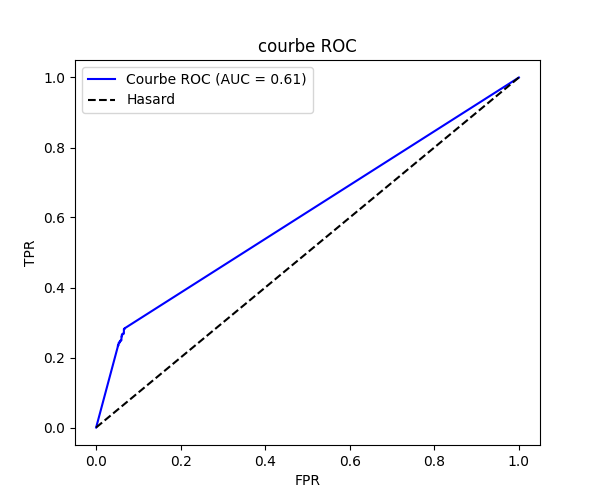
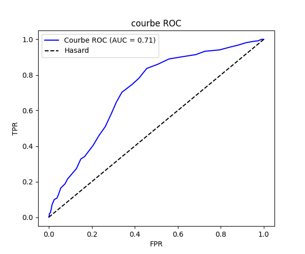
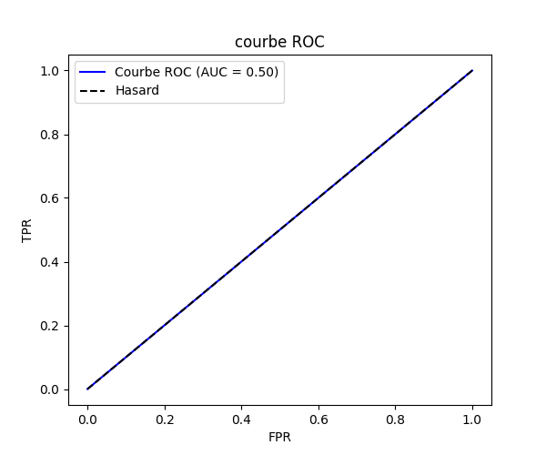
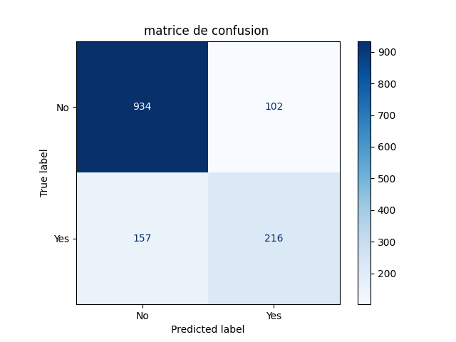
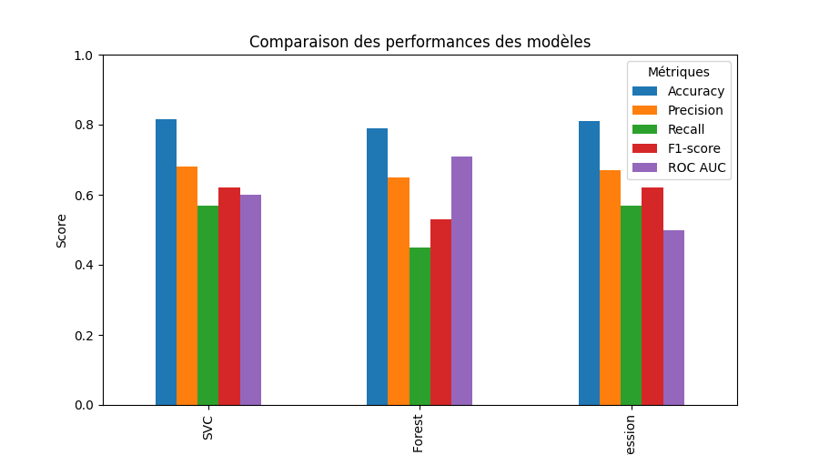

#Tableau récapitulatif des performances des modèles :

|Model                 |accuracy|precision_score |recall_score|f1_score|roc_auc_score  |ROC         |matrice confusion  |
|----------------------|--------|----------------|------------|--------|---------------|------------|---------------|
|##SVC##               |0.816   |0.68            |0.57        |0.62    |0.60           ||       |
|----------------------|--------|----------------|------------|--------|---------------|------------|---------------|
|##Random forest##     |0.79    |0.65            |0.45        |0.53    |0.71           || 
|----------------------|--------|----------------|------------|--------|---------------|------------|---------------|
|##LogisticRegression##|0.81    |0.67            |0.57        |0.62    |0.5            || 
|----------------------|--------|----------------|------------|--------|---------------|------------|---------------|

#SVC est le meilleur modèle globalement car Il a la meilleure Accuracy (0.816) et un bon F1-score (0.62)

#comparaison du performance des trois models:

